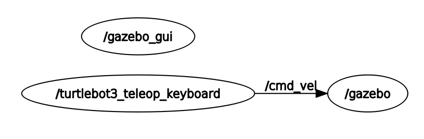

# Thor, the Turtle

Repositório público para o Processo Seletivo da Comp.

Esse repositório contém um [metapackage](http://wiki.ros.org/Metapackages) de ROS que deverá ser usado para desenvolver a tarefa final do PS.

## Sumário
- [Sumário](#Sumário)
- [Requisitos](#Requisitos)
- [Estrutura](#Estrutura)
- [Primeiros passos](#Primeiros-passos)
- [Tarefa](#Tarefa)
    - [Especificações do projeto](#Especificações-do-projeto)
    - [Recomendações](#Recomendações)
    - [Prazo](#Prazo)
- [Referências](#Referências)

## Requisitos

### Python3
Caso seu sistema não tenha vindo com Python3 instalado por padrão, atualize para evitar problemas de compatibilidade.
```bash
sudo apt update
sudo apt install python3
```

### ROS 1
Para instalar o ROS, siga o toturial oficial de instalação disponível [neste link](http://wiki.ros.org/noetic/Installation). Recomenda-se instalar a última versão (ROS Noetic), em Ubuntu 20. Instale a versão completa para ter acesso aos pacotes de simulação necessários.
```bash
sudo apt update
sudo apt install ros-noetic-desktop-full
```

## Estrutura
Esse meta-pacote possui três pacotes listados a seguir.

1. `turtlebot3_description`

    Contém a descrição dos robôs TurtleBot3: Burger, Waffle e Waffle Pi.
    A princípio, utilizaremos o Burger, que é um pouco mais simples, mas sinta-se a vontade para brincar com os outros também!

2. `turtlebot3_gazebo`

    Contém os ambientes para simulação dos robôs no [Gazebo](http://gazebosim.org/tutorials?tut=ros_overview)

3. `turtlebot3_example`

    Contém exemplos de nodes para controlar os robôs

## Primeiros passos

Para compilar os pacotes, rode o seguinte comando na pasta raíz do workspace:
```bash
catkin_make
```

Em seguida, é preciso indicar qual dos robôs será utilizado na simulação com o comando.
```bash
export TURTLEBOT3_MODEL=${burger}
```
Note que esse passo é necessário em qualquer novo terminal que for aberto.

Para rodar a simulação, devemos escolher qual ambiente será utilizado. O pacote de simulação contém vários launch files, cada um para um ambiente diferente. Para abrir a simulação no TurtleBot World, execute o comando:
```bash
roslaunch turtlebot3_gazebo turtlebot3_world.launch
```

A GUI do Gazebo deve abrir com o ambiente e robô selecionados. Porém, ele não faz nada, pois não há nenhum node se comunicando com o simulador ainda. Vamos executar o exemplo de teleoperação para controlar o TurtleBot usando o teclado.
```bash
roslaunch turtlebot3_example turtlebot3_teleop_key.launch
```

Agora, é possível controlar a velocidade angular e linear do robô usando as teclas indicadas. Para entender melhor o que está acontecendo, é possível listar os nodes e tópicos pelo terminal, ou usar o [rqt](http://wiki.ros.org/rqt) para uma visualização mais direta.



Explore os outros ambientes disponíveis e tente entender o código dos 4 exemplos fornecidos. Comece do mais simples para o mais complexo. Sugerimos a ordem: `teleop`, `obstacle`, `pointop` e por fim, `drive`. Caso tenha dúvidas, o ROS tem uma [wiki](http://wiki.ros.org/) com documentação excelente, e é claro, pergunte para seus veteranos.

## Tarefa

Agora é a hora de aplicar tudo o que vocês aprenderam no PS inteiro. Nesse projeto, vocês trabalharão em grupos de 3, e para que isso funcione, é muito importante relembrar como usar o git e como organizar as branches do repositório, mantendo tudo sempre organizado.

Como vocês já devem ter lido no fórum, vocês devem programar um robô aspirador de pó estilo Roomba:


O objetivo de vocês é que ele consiga se movimentar por um ambiente parecido com uma casa sem colidir com móveis e paredes, e cobrindo a maior área possível. Um bom lugar para buscar inspiração é nos próprios manuais desses robôs, para descobrir quais diferentes modos de operação eles possuem.

### Especificações do projeto

- Vocês devem criar um novo pacote de ROS e adicioná-lo ao meta-pacote `thor_the_turtle`. O nome do pacote criado é livre, mas é essencial que todo o código produzido esteja nele.
- Utilizem python para programar os scripts e módulos.
- Lembrem-se que é preciso configurar os arquivos `package.xml` e `CMakeLists.txt` para que o pacote seja executado corretamente.

### Recomendações

- Não adianta sair programando se vocês não sabem o que estão tentando fazer. Pensem no problema que precisam resolver, discutam em grupo e com seus veteranos, implementem uma possível solução, testem. (E como nada funciona de primeira, repitam o processo).
- Documentem o código e o pacote em sí. Vai ajudar todo mundo.
- Não modifiquem os 3 pacotes já existentes, priciplamente o de simulação e o de descrição dos robôs.

### Prazo

Vocês tem até xx/09/2020 para entregar o projeto concluído. Organizem o tempo e não deixem para a última hora.

## Referências
Todo o material presente aqui foi adaptado dos repositórios originais do TurtleBot3. Para mais informações:
- [e-Manual](https://emanual.robotis.com/docs/en/platform/turtlebot3/overview/)
- [Source Code Rpository](https://github.com/ROBOTIS-GIT/turtlebot3)
- [Simulation Repository](https://github.com/ROBOTIS-GIT/turtlebot3_simulations)
- [ROS Messages Repository](https://github.com/ROBOTIS-GIT/turtlebot3_msgs)